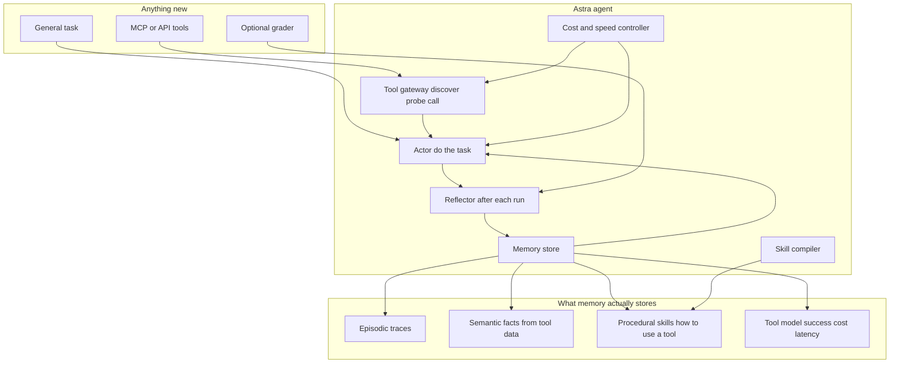
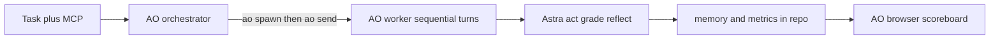

# Astra

**A self-improving, tool-agnostic agent.** Give Astra any third-party tool surface (MCP server / API) and a general task. It does the task, reflects on its own trace, grows durable memory and skills, and is measurably better — more accurate, fewer tool calls, cheaper, faster — on the next run. Plug in a tool it has never seen and the same loop starts again with zero code changes.

Built in 30 hours for **Syndicate by Maximor, Track 1: Automated Agent Engineering**, entirely inside **Agent Orchestrator (AO)**.

- Repo: https://github.com/robu9/Astra
- Design spec: [`docs/spec.md`](docs/spec.md)
- Track: [Devpost](https://syndicate-by-maximor.devpost.com/) · [AO](https://aoagents.dev/)

---

## Table of contents

1. [What Track 1 asks, and Astra's answers](#1-what-track-1-asks-and-astras-answers)
2. [Architecture](#2-architecture)
3. [The learning loop, step by step](#3-the-learning-loop-step-by-step)
4. [Memory: what is stored and how it is retrieved](#4-memory-what-is-stored-and-how-it-is-retrieved)
5. [Cost and speed control](#5-cost-and-speed-control)
6. [Tool-agnostic by construction](#6-tool-agnostic-by-construction)
7. [Evaluation: fixtures, graders, metrics](#7-evaluation-fixtures-graders-metrics)
8. [Results](#8-results)
9. [How to run Astra](#9-how-to-run-astra)
10. [How we built it with AO](#10-how-we-built-it-with-ao)
11. [Repo layout](#11-repo-layout)
12. [Honest limits](#12-honest-limits)

---

## 1. What Track 1 asks, and Astra's answers

The track brief (Devpost + organiser clarification on Discord) asks for **a well-engineered agent whose learning loop lets it get genuinely better over time at using third-party tools**, domain-agnostic, with a good cost/speed balance. Four explicit questions:

### Q1. How does it get better over time?

Every run is the same five-stage cycle: **act → trace → reflect → write memory → retrieve next time.** The policy code never changes between runs; the *context Astra has earned* does.

| After run N Astra writes | Which changes run N+1 |
| --- | --- |
| **Semantic facts** extracted from tool payloads (e.g. "`health: R` means at risk", "`[billing]` prefix is the component") | The actor is told these facts and stops re-deriving them |
| **Tool conventions** (exact enum casing, pagination cursor, hidden id formats) | The tool listing itself carries the learned notes; calling errors disappear |
| **A procedural skill** (ordered steps + tools) — *candidate* until the next run confirms it | Controller switches to `skilled` mode: fast model, tight step budget |
| **A prompt patch** (2–5 lines of self-instruction) — *candidate* until confirmed | Actor system prompt changes |
| **An episode** (quality, calls, cost, what went wrong) | Controller uses it to pick model tier and step budget |

Candidates are kept only if the next run's quality does not regress (**keep-or-revert**, `astra/engine.py:_resolve_candidates`). Skills accumulate wins/uses; facts gain confidence when re-observed and are demoted when reflection flags them wrong.

### Q2. Can you show outputs getting better through self-reflection and memory growing?

Yes, and everything is a plain file you can diff:

- `runs/results.tsv` — one row per run: quality, success, tool calls, tool errors, tokens, cost, latency, facts, skills, kept/reverted, what went wrong.
- `runs/<run>/trace.json` — every step, tool call, observation, model, cost.
- `runs/<run>/reflection.json` — exactly which facts, conventions, skill and prompt patch were written after that run.
- `memory/semantic.json`, `memory/skills.json`, `memory/tool_model.json`, `memory/episodic.jsonl`, `memory/prompt_patches.json` — the growing memory itself.
- `scoreboard/index.html` — quality / cost / tool calls / latency curves plus the live memory contents.

Run 1 on a new tool: wrong enum casing, one page of results, ignores notes, raw owner ids. Run 3: paginates, reads notes, resolves owners, flags inactive reps, half the cost. See [Results](#8-results).

### Q3. Can it learn complex contextual logic from third-party data and apply it later?

That is the specific thing the fixtures test. The hidden rules live **in the data, not the schema**, and the data is regenerated with a new seed each run so ids can never be memorised — only understanding transfers:

- CRM: `health` is a colour code `G/A/R`; free-text notes with "PO pending" / "budget freeze" mean at-risk even when health is green; owners with `active:false` have left and their deals must be reported `UNASSIGNED`; closed stages are not open.
- Tracker: priority meaning is in `list_labels` descriptions (sev-1 outage / data loss, sev-2 broken / 500 / fails, sev-3 minor); component is the `[bracket]` prefix in the title and each member `owns` components; a comment "duplicate of #N" means label `duplicate` and do not assign.

Graders never reveal these rules. They say *how many* were missed and *which ids*; reflection has to inspect the trace and infer the rule. The rules then appear verbatim in `memory/semantic.json` and are applied on the next, different snapshot.

### Q4. Does it balance cost-effectiveness and speed?

The **controller** (`astra/controller.py`) routes every run:

| Situation | Model | Step budget | Mode |
| --- | --- | --- | --- |
| No episodes for this task on these tools | strong | 30 | `novel` |
| Last run scored < 0.4 | strong | last calls × 1.5 + 16 | `recovering` |
| Promoted skill + ≥50 % tools known + last run succeeded | **fast** | last calls × 1.5 + 6 | `skilled` |
| Otherwise | fast if tools known, else strong | in between | — |

Plus: reflection uses the fast model unless the run failed badly; the gateway caches identical read-only calls within a run; probing of a tool's return shape happens once per tool ever; the tool model warns the actor away from tools with a bad success rate. Measured effect in the smoke run below: tracker cost **$0.129 → $0.0067 per run (19×)**, latency **1.0 s → 0.4 s**, tool errors **25 → 0**, quality **0.04 → 1.00**.

---

## 2. Architecture

Same diagram as the design spec. Nothing inside `astra` knows what app is behind a tool.



| Component | File | One-line job |
| --- | --- | --- |
| Tool gateway | `astra/gateway.py` | Attach any `ToolServer`, namespace tools `server.tool`, probe arg-less read tools once, call with timing / error signatures / per-run cache, feed the tool model |
| Actor | `astra/actor.py` | JSON-protocol ReAct loop: one tool call or one final answer per turn, memory injected into the prompt, no app logic |
| Memory | `astra/memory.py` | Episodic, semantic, skills, tool model, prompt patches. File-backed. Scoped retrieval |
| Reflector | `astra/reflector.py` | Reads trace + grade, writes facts / conventions / skill / prompt patch / episode |
| Controller | `astra/controller.py` | Picks model tier, step budget and mode from memory |
| Engine | `astra/engine.py` | run → grade → keep-or-revert → reflect → record |
| MCP client | `astra/tools/mcp_stdio.py` | Real MCP over stdio (`initialize`, `tools/list`, `tools/call`) |
| MCP server shim | `astra/tools/mcp_serve.py` | Exposes any in-process server as a real MCP process (used to run fixtures over MCP) |
| Fixtures | `astra/fixtures/` | Two unseen "third-party apps" with hidden rules and API quirks |
| Tasks + graders | `astra/tasks.py` | General tasks repeated over fresh snapshots; graders never leak rules |
| LLM judge | `astra/judge.py` | Scores arbitrary user tasks when there is no grader |
| AO client | `astra/ao_client.py` | `ao spawn` / `ao send` / HTTP fallback; sequential learning turns in one AO worker |

How AO wraps the runtime:



---

## 3. The learning loop, step by step

One iteration (`Engine.run_once`):

1. **Attach** the tool servers. Gateway lists tools, registers them in the tool model, probes arg-less read tools once (learns return shape, e.g. `object keys=['items','next_cursor','total']; items[0] keys=[...]`).
2. **Plan budget.** Controller looks at episodes, skills and tool-model coverage → model tier, step budget, mode.
3. **Retrieve.** Memory returns facts (scoped to attached servers + task keywords), the skill for this task family, the last 3 episodes, and the active prompt patch.
4. **Act.** Actor runs the JSON tool-calling loop. Each observation is the full tool payload (up to 3.5 KB) so pagination cursors and nested fields are visible. Errors are shown verbatim and the actor is told to fix, not loop.
5. **Grade.** Fixture grader (ground truth) or LLM judge (arbitrary tasks) → `quality ∈ [0,1]`, feedback, success.
6. **Keep or revert.** Candidates proposed after the previous run are promoted if `quality ≥ prev − 0.05`, else rejected / rolled back.
7. **Reflect.** Reflector (fast model, strong if the run failed badly) emits facts, tool conventions, a skill, a prompt patch, bad-facts to demote, and one sentence on what went wrong. All of it is written to `memory/`.
8. **Record.** Trace, reflection and a metrics row are persisted. Servers are detached; the tool model persists.

Nothing in this loop references CRM, tracker, GitHub, or any other app.

---

## 4. Memory: what is stored and how it is retrieved

| Store | File | Entry | Retrieval |
| --- | --- | --- | --- |
| Episodic | `memory/episodic.jsonl` | run id, family, servers, quality, success, calls, errors, cost, mode, what went wrong | last 3 for the exact same family and server set |
| Semantic | `memory/semantic.json` | fact, server (or `null` = general lesson), source tool, evidence quote, confidence, first/last run, seen count, tags | score = confidence × (1 + 0.4 × keyword overlap) + bonus for matching server; top 12; facts from other servers are excluded |
| Procedural | `memory/skills.json` | name, when, steps[], tools[], servers, family, status `candidate/promoted/rejected`, version, wins/uses | skills whose servers ⊆ attached servers and whose family or `when` matches |
| Tool model | `memory/tool_model.json` | per tool: calls, ok, errors, latency total, error signatures, conventions[], probed, shape | injected as `learned:` notes under each tool in the prompt; drives the `known tools` ratio in the controller |
| Prompt patches | `memory/prompt_patches.json` | per family@servers: active text, candidate, history with kept/reverted | injected as SELF-INSTRUCTIONS |

Namespacing matters: facts learned on `crm` are never shown when only `tracker` is attached, but `server: null` lessons ("read all pages before deciding") transfer to every new tool. That is the mechanism behind "expose it to a new MCP and it keeps improving".

---

## 5. Cost and speed control

Levers, all measurable in `results.tsv`:

- **Model routing** (`skilled` → fast model). Reflection also on the fast model unless quality < 0.3.
- **Step budgets** derived from the last run's real call count, not a constant.
- **Per-run read cache** in the gateway (`cached_calls` column).
- **Probe once, ever** — return shapes live in the tool model.
- **Tool-model hints** stop the actor re-discovering conventions (this is where most wasted calls on run 1 come from).
- **Actor cost ceiling** (`Budget.max_cost_usd`); once crossed, the action loop makes no additional model or tool call.
- **Skill first** — with a promoted skill the actor is told the exact step order and stops exploring.

---

## 6. Tool-agnostic by construction

Astra sees only `ToolSpec {name, description, input_schema, annotations}` and JSON results. Two adapters implement `ToolServer`:

- `InProcessServer` — Python functions decorated with `@tool` (fixtures use this).
- `MCPStdioServer` — any MCP server launched as a subprocess. Verified end to end by running the fixtures themselves as MCP processes (`--transport mcp`).
An HTTP/OpenAPI adapter can be added behind the same interface, but is not included today.

To attach a real third-party MCP:

```bash
python3 -m astra attach \
  --mcp "gh=npx -y @modelcontextprotocol/server-github" \
  --task "List open PRs older than 7 days with reviewers and the blocker" \
  --schema '{"stale_prs":[{"number":"int","title":"string","reviewers":["string"],"blocker":"string"}]}' \
  --family gh_stale_prs --runs 3
```

No grader exists for arbitrary tasks, so the LLM judge scores them. Learning still shows in tool errors, calls, cost, latency and in `memory/` growth.

---

## 7. Evaluation: fixtures, graders, metrics

**Why fixtures instead of a public benchmark.** The brief is about learning *inside* a third-party tool's data over repeated runs. That needs (a) hidden business rules, (b) fresh data each run so ids cannot be memorised, (c) ground truth for honest scoring. Public benchmarks give none of these. The fixtures are deliberately small and quirky in the ways real SaaS APIs are quirky (pagination, cryptic enums, ids instead of names, information hidden in free text, records that should be skipped).

| Family | Tool surface | General task | Grader |
| --- | --- | --- | --- |
| `crm_at_risk` | 5 tools | Weekly at-risk pipeline report with owner and reason | 0.75 × F1 on deal set + 0.25 × owner accuracy |
| `tracker_triage` | 7 tools, 2 of them writes | Triage every open issue per the team's conventions | 0.6 × label accuracy + 0.4 × assignee accuracy, read from actual server state |

Metrics per run: `quality`, `success`, `tool_calls`, `tool_errors`, `cached_calls`, `llm_tokens`, `cost_usd`, `reflect_cost_usd`, `latency_s`, `facts`, `skills_promoted`, `skills_candidate`, `tools_known`, `kept`, `what_went_wrong`.

Each run uses seed `N`, so run 3 sees deals, owners, issues and comments run 1 never saw.

---

## 8. Results

The results below were produced with a **real model (Gemini 2.5 Flash), real MCP stdio transport, fresh memory, and one continuous session** across three previously unseen tool surfaces. The active `memory/` and `runs/` directories are intentionally reset for a fresh demo; the prior results remain auditable in Git history and in `docs/friend-branch-runs.*`. Each run used a different data snapshot (ids, names and records changed), so memorising an answer could not help.

```
run                   mode         quality  ok calls errs   cost$  lat s facts skills  kept
crm_at_risk-r01       novel           0.00   F     5    1  0.0084   19.1     3      0  n/a
crm_at_risk-r02       recovering      0.17   F     1    0  0.0017    4.5     5      0  kept
crm_at_risk-r03       recovering      0.62   F     4    1  0.0082   18.3     7      0  kept
crm_at_risk-r04       novel           0.62   F    10    0  0.0154   26.0     7      1  kept
crm_at_risk-r05       skilled         0.79   F    19    0  0.0302   44.1     9      1  kept
tracker_triage-r01    novel           0.04   F     4    0  0.0061   14.0     5      1  n/a
tracker_triage-r02    recovering      0.71   F    21    0  0.0344   58.8     8      1  kept
tracker_triage-r03    skilled         0.71   F    27    0  0.0473   74.9     8      2  kept
tracker_triage-r04    skilled         0.71   F    24    0  0.0489   78.1    12      2  none
tracker_triage-r05    skilled         0.78   F    35    0  0.0788   92.5    17      2  kept
gh_bug_triage-r01     novel           0.30   F     1    0  0.0159   27.9     4      2  n/a
gh_bug_triage-r02     recovering      0.20   F     6    0  0.0418   55.9     6      2  reverted
gh_bug_triage-r03     recovering      0.40   F     2    1  0.0127   23.7     8      2  kept
gh_bug_digest-r01     novel           0.00   F     3    0  0.0285   44.1    11      2  n/a
gh_bug_digest-r02     recovering      1.00   T     1    0  0.0115   19.3    12      2  kept
gh_bug_digest-r03     novel           0.40   F     1    0  0.0094   15.7    13      2  reverted
gh_bug_digest-r04     novel           1.00   T     1    0  0.0187   27.9    13      2  kept
```

`crm_*` and `tracker_*` are graded against hidden ground truth. `gh_*` ran against the **real GitHub MCP server** (`@modelcontextprotocol/server-github`, live data from `Untrivial-ai/agent-orchestrator`) and are scored by the LLM judge.

**Accuracy.** CRM 0.00 → 0.79; tracker 0.04 → 0.78; GitHub digest 0.00 → 1.00 (twice). The dips (`crm r02`, `gh_bug_digest r03`) are what a new snapshot does to a half-learned rule; the gate handles them (below).

**Reliability.** Run 1 of every family contains the classic first-contact mistakes: an invalid enum (`stage='OPEN'`), a stop after page 1, a hallucinated tool (`github.list_collaborators`). Each becomes a tool-model note or a fact after one reflection and does not recur.

**Contextual logic learned from tool data, not from the schema** (`memory/semantic.json`, confidence in brackets):

- CRM: *"Deals with notes indicating 'PO pending' or 'no ETA' should be considered at risk"* [0.9]; *"Deals whose owner has active=false are UNASSIGNED"* [0.9]; *"Amber health alone is not at risk unless notes say so"* [0.9]; *"list_deals does not accept 'OPEN'; open = not closed_won/closed_lost"* [1.0].
- Tracker: *"Issues that are duplicates, as indicated by comments, should be labeled 'duplicate' and not assigned an owner"* [1.0]; *"Assignees are determined by matching the [module] in the title to members' owns field"* [1.0]; *"'Typo' / 'Minor alignment issue' ⇒ sev-3"* [0.9].
- GitHub: *"list_issues returns the comments count directly, no separate call needed"* [1.0]; *"github.list_collaborators is not available"* [1.0]; *"assigned = assignees list non-empty"*.

The tracker duplicate rule is the interesting one. Runs 1–2 never called `tracker.list_comments`, so the reflector could not explain why some "obvious" issues were marked wrong. Because the reflector is told which tools were **never called**, and the actor is told the same when previous runs scored low, run 3 started reading comments and run 5 wrote the rule down. That is the exploration → evidence → durable rule path, and it required no fixture-specific code.

**Cost and speed.** Within a family, cost tracks how much the agent chooses to *verify* (tracker cost rises with quality because it reads more comments). Across families the reuse effect is visible: GitHub digest run 2 solved the task in **one** tool call for $0.0115 after run 1 spent three calls and $0.0285 learning `sort=updated, per_page=10`. A run costs 1–8 cents and 15–90 s end to end including reflection.

**The keep-or-revert gate.** `gh_bug_triage r02` and `gh_bug_digest r03` show `reverted`: a prompt patch was proposed, the next run scored lower, the patch was rolled back to the previous active text. Candidate skills for `gh_bug_digest` v1 were *rejected* for the same reason; the second proposal became the candidate. Nothing is accepted on the reflector's say-so.

**An honest negative.** `gh_bug_triage` asked for "did a maintainer reply?", which this MCP server cannot answer (it has no list-comments tool). Quality stayed at 0.2–0.4. The reflection for run 3 says exactly that ("attempted to call an unavailable tool, `github.list_collaborators`"), and the fact *"list_collaborators is not available"* carried over into `gh_bug_digest`. A wrong task is diagnosed, not papered over.

`scoreboard/index.html` renders these curves and the live memory view. Offline smoke runs (`ASTRA_LLM=mock`) exercise the same loop deterministically without a key.

---

## 9. How to run Astra

Requirements: Python 3.11+ (stdlib only). Node only if you attach npm-distributed MCP servers.

```bash
git clone https://github.com/robu9/Astra.git && cd Astra
cp .env.example .env       # set ASTRA_LLM_API_KEY (+ base URL / model names). Any OpenAI-compatible endpoint.

# Full demo: unseen tool surface #1 x5, then unseen tool surface #2 x5, same agent
python3 -m astra demo --runs 5

# One family, through a real MCP stdio process
python3 -m astra run tracker_triage --runs 5 --transport mcp

# What Astra knows now
python3 -m astra memory

# Regenerate the scoreboard, then open scoreboard/index.html
python3 -m astra scoreboard

# Attach any external MCP + any task (LLM-judged). Write-style tools are hidden unless --allow-writes.
export GITHUB_PERSONAL_ACCESS_TOKEN=$(gh auth token)
python3 -m astra attach --mcp "github=npx -y @modelcontextprotocol/server-github" \
  --task "Digest the 10 most recently updated open 'bug' issues in owner/repo: number, title, age_days, comments, assigned" \
  --schema '{"issues":[{"number":"int","title":"string","age_days":"int","comments":"int","assigned":"bool"}]}' \
  --family gh_bug_digest --runs 4

# Start over
python3 -m astra reset
```

Offline smoke test without a key: `ASTRA_LLM=mock python3 -m astra --memory /tmp/m --runs /tmp/r demo --runs 3`.

Inside an AO worker session, preview the scoreboard beside the agent: `ao preview scoreboard/index.html`.

---

## 10. How we built it with AO

AO usage was mandatory and is 25 % of the score. AO played two roles.

**Role 1 — build plane.** The repo is an AO project. The project orchestrator held the design conversation and split the work into focused workers, each in its own worktree:

| AO worker | Scope |
| --- | --- |
| runtime core | gateway, memory stores, controller, actor, reflector |
| MCP transport | stdio client + server shim, verified fixtures over MCP |
| fixtures + graders | CRM and tracker apps with hidden rules, seeded snapshots |
| engine + CLI | run/grade/keep-or-revert/reflect loop, results.tsv, CLI |
| scoreboard | static scoreboard + data builder |
| docs | README, AGENTS.md, AO skills |

Reviews and fixes (e.g. the `@tool` schema leaking `self`, observation truncation hiding `next_cursor`, skills being demoted back to candidate on re-proposal) were routed back to the owning session.

**Role 2 — run plane.** `python3 -m astra ao-run crm_at_risk --runs 5` creates one AO worker and sends it five sequential learning turns. Waiting between turns guarantees that run N+1 sees run N's committed memory. Before continuing, the controller verifies that the expected result, trace, reflection, memory and scoreboard were committed and that the exact commit reached the AO branch on `origin`. The worker follows the `learning-run` skill (`.agents/skills/learning-run/SKILL.md`) and reports what Astra learned. The AO transcript shows the learning history, and `ao preview scoreboard/index.html` shows the curves beside it.

`AGENTS.md` tells any AO worker the rules (keep Astra tool-agnostic, never leak rules through graders, never hand-edit memory). The demo video shows the AO dashboard with the session count, a run-1 vs run-N comparison, the memory files growing, and a second MCP attached with no code change.

---

## 11. Repo layout

```
astra/
  actor.py          the agent policy (tool-agnostic)
  reflector.py      post-run learning
  controller.py     cost/speed routing
  gateway.py        tool discovery, probing, calling, tool model
  memory.py         episodic / semantic / skills / tool model / prompt patches
  engine.py         run -> grade -> keep/revert -> reflect -> record
  judge.py          LLM judge for arbitrary tasks
  llm.py            OpenAI-compatible client + cost accounting + offline mock
  ao_client.py      AO spawn/send/status wait, sequential learning in one worker
  scoreboard.py     builds scoreboard/data.js
  cli.py            demo | run | attach | ao-run | memory | scoreboard | reset
  tools/            base ToolServer, MCP stdio client, MCP server shim
  fixtures/         crm.py, tracker.py (unseen third-party stand-ins)
  tasks.py          task families + graders
memory/             the growing memory (committed by learning runs)
runs/               per-run traces, reflections, results.tsv
scoreboard/         index.html + data.js
.agents/skills/     AO skills: learning-run, attach-mcp
docs/spec.md        design spec
AGENTS.md           rules for AO / coding-agent workers
```

---

## 12. Honest limits

- Two fixtures plus one real MCP, small data, 17 committed runs. Enough to show the loop; not a benchmark.
- Curves are noisy run-to-run because every run is a new snapshot and the model is Gemini 2.5 Flash at low reasoning effort; the trend and the memory contents are the evidence, not any single row.
- The offline mock is knowledge-gated and fixture-aware. It proves the memory mechanics deterministically; it is not model intelligence.
- Keep-or-revert compares against the previous run on a *different* data snapshot, so a 0.05 tolerance is used; a noisy snapshot can still promote a mediocre patch (visible as `kept` followed by a dip).
- Skills are one per family per server set; there is no skill library across families yet.
- The LLM judge for arbitrary tasks can be gamed by a confident answer; ground-truth graders are preferred whenever the task allows one.
