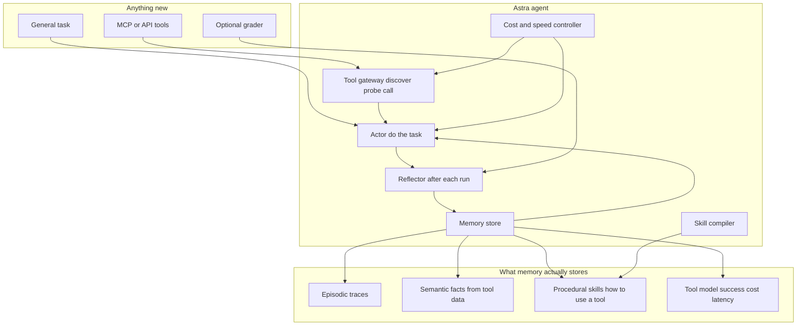
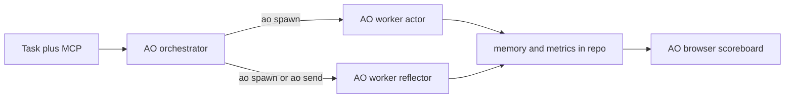

# Astra: a self-improving tool-using agent

## Correction (what Track 1 actually wants)

The Discord note is the judging intent. Combined with Devpost, the product is **the agent and its learning system**, not a workflow app and not a factory that invents many specialized agents.

They are scoring **system design of the learning loop**:

- Given **third-party app access** (tools / MCP / APIs) and a **general task**, the agent **gets better at that task over time**
- Domain is a demo fixture. It does not define the product
- When you later expose it to a **new** MCP or a **new** general task, it should still work and keep improving — without a rewrite

The four questions the agent must answer in the demo:

1. **How does it get better over time?**
2. **Can you show outputs improving through self-reflection and memory growing?**
3. **Can it learn complex contextual logic from third-party tool data and apply it on later runs?**
4. **Is there a real cost / speed balance?**

Original Devpost still applies: generate architecture, run, analyze failure, improve prompts / tools / memory / orchestration, and show accuracy, reliability, cost, speed. Discord says that improvement must be **online, across runs, on real tool use** — not an offline benchmark that mutates YAML for three toy domains.

## What we are building

**Astra = one agent whose job is to learn how to use tools.**

You plug in:

- Any MCP server or HTTP API (schema in, no hardcoded app logic)
- A general task in natural language
- Optional success signal (grader, human thumbs, or task-defined check)

Astra then:

1. Discovers the tools
2. Attempts the task (run 1 is allowed to be naive)
3. Reflects on the trace
4. Writes durable memory and skills
5. On run 2..N, retrieves that memory, uses tools more precisely, and produces better output cheaper/faster
6. If you attach a **new** MCP mid-demo, it repeats 1–5 for that tool surface

AO is how we **build and show** this (mandatory). AO is not the product. We do not fork AO and we do not build a competing desktop IDE.

## Architecture (the thing that has to be excellent)

### 1. Tool gateway (tool-agnostic)

No GitHub-specific or Gmail-specific agent code.

- Connect any MCP / OpenAPI-like tool list
- Discover names, schemas, required args
- **Probe** unknown tools cheaply (read-only first when possible)
- Record: what the tool actually returns, failure signatures, auth/permission errors, pagination quirks
- Maintain a **tool model**: `P(success)`, typical latency, token cost, when *not* to call it

This is how “new third-party tool” works on day two: attach MCP, gateway learns the surface, actor stays the same.

### 2. Actor (does the work)

A single agent with a small, explicit orchestration policy — not a pile of hardcoded workflows:

- Plan only when the tool model says the task is novel or high-stakes
- ReAct / tool-calling for known skills
- Stop early when a retrieved skill already matches
- Never dump entire API payloads into the next prompt; write facts into semantic memory and retrieve slices

### 3. Memory (must be visible and growing)

Four stores, all git-diffable files under `memory/` so the demo can show them filling up:

- **Episodic** — run id, task, tools used, outcome, what went wrong
- **Semantic** — durable facts *extracted from third-party data* (the Discord “complex contextual logic” requirement). Example shape: `entity`, `fact`, `source_tool`, `evidence`, `confidence`, `last_seen_run`
- **Procedural skills** — “when the task looks like X, call tools in this order with these args.” Promoted only after repeated success
- **Tool model** — per-tool stats and learned calling conventions (enum values that actually work, required extra fields the schema omitted, rate limits)

Retrieval is scoped: current task + current tool names. Memory from MCP A must not blindly pollute MCP B, but *learning how to learn tools* transfers.

### 4. Reflector (the actual learning loop)

After every run, a separate reflection pass (cheaper model when possible):

- What did the user want vs what happened
- Which tool calls were wasted, wrong, or gold
- What new facts about the *world inside the third-party app* should be stored
- What skill should be created or patched
- Whether the actor prompt / tool subset / step limit should change

Reflection writes memory. It does not just append a chat log.

Keep-or-revert rule: a skill or prompt patch is promoted only if the next run’s primary metric does not regress, and cost/latency stay inside budget.

### 5. Cost and speed (first-class, not a slide)

- Route: small/fast model for retrieval + known skills; larger model only on novel tasks or reflection
- Skip tools with a bad tool-model score unless the task requires them
- Cache identical tool calls within a run
- Bound `max_steps` and tokens; reflection can raise/lower the bound
- Prefer one skilled tool sequence over exploratory spray

Show this on the scoreboard: later runs should do **fewer tool calls**, **lower $**, **lower latency**, **higher quality**.

## How improvement happens (answer their bullets)

**How does it get better over time?**
Each run is `act → trace → reflect → write memory/skills/tool-model → retrieve next time`. The policy is the same binary; the *context it has earned* changes.

**Outputs get better via self-reflection and memory growing?**
Demo shows run 1 output vs run N output on the same task family, plus the `memory/` tree growing (new facts, new skills). Reflections are first-class artifacts, not hidden chain-of-thought.

**Learn contextual logic from third-party data, apply later?**
Run 1 reads raw tool payloads and maybe fumbles. Reflector extracts rules/facts (“this workspace uses label `sev-1` for outages”, “invoices from vendor X hide tax in notes”). Run N applies those facts without re-discovering them.

**Cost-effectiveness and speed?**
Controller + tool model. Later runs should not re-probe tools it already understands.

**New MCP or new general task?**
Gateway discovers the new schema. Actor has no app-specific code. Memory namespaces by tool server. Learning loop is unchanged. That is the “works flawlessly and keeps improving” requirement.

## AO integration (unchanged eligibility, different runtime story)

AO rule from Devpost: **build the project in AO from start to finish**. Demo must show AO sessions and the dashboard. 25% of score.

Do not fork [agent-orchestrator](https://github.com/Untrivial-ai/agent-orchestrator). Installed desktop + daemon `127.0.0.1:3001` + `ao` CLI.

How AO maps onto this agent:

- Astra repo is the AO project
- **Orchestrator** supervises: “run task T against MCP X”, “run reflection”, “attach a new MCP and repeat”
- **Each task run** = AO worker (isolated worktree or scratch dir), so Kanban fills with real sessions
- **Each reflection** can be a follow-up `ao send` on the same session or a small critic worker
- Scoreboard + memory browser via `ao preview`

## What not to build

- A second Electron/Tauri IDE that looks like AO
- A domain product (inbox app, CFO app, support desk) with a thin agent wrapper
- A meta-factory whose demo is “we generated 3 agent YAMLs for 3 synthetic domains”
- Fine-tuning
- Hardcoded playbooks for one SaaS

Demo still needs **fixtures**. Those fixtures are not the product. Ship two small fake-but-realistic MCP apps (e.g. a toy CRM and a toy project tracker) the agent has never been taught, plus the ability to point at a real MCP if keys exist. The live moment is: attach MCP B that run 1–5 never saw, watch discovery + learning start again.

## Repo layout

- [`runtime/gateway.py`](runtime/gateway.py) — MCP/API discover, probe, call, cache
- [`runtime/actor.py`](runtime/actor.py) — policy that uses memory + tool model
- [`runtime/reflector.py`](runtime/reflector.py) — post-run learning
- [`runtime/controller.py`](runtime/controller.py) — model routing, step/cost budgets
- [`memory/`](memory/) — episodic, semantic, skills, tool_model (durable)
- [`engine/loop.py`](engine/loop.py) — run → reflect → score → keep/revert
- [`engine/ao_client.py`](engine/ao_client.py) — `ao spawn` / `ao send` / session poll
- [`fixtures/mcp_a/`](fixtures/mcp_a/) [`fixtures/mcp_b/`](fixtures/mcp_b/) — unseen third-party stand-ins
- [`eval/`](eval/) — task families + graders; metrics over runs
- [`scoreboard/index.html`](scoreboard/index.html) — quality, reliability, $, latency, memory size, tool-call count
- [`.agents/skills/`](.agents/skills/) — AO skills so workers follow the protocol

## How to proceed

Deadline **Sun 6 Sep 2026, 6:00pm EDT**. Build the loop first; fixtures second; chrome last.

1. Open this repo in AO and start spawning workers now (eligibility).
2. Implement gateway + actor + four memory stores + reflector + controller as one local runtime.
3. Stand up fixture MCP A, run the same general task 5 times, prove run N > run 1 on quality and (ideally) cost/speed. Show memory files growing.
4. Attach fixture MCP B with no code change; show discovery and a second improving curve.
5. Wire each run/reflection to AO sessions; preview the scoreboard.
6. Neatlogs on traces (sponsor + a judge).
7. Demo: AO Kanban → run 1 mediocre → memory/skills appear → run N better → new MCP → it learns again.

## Demo narrative

1. AO dashboard already has Astra run sessions.
2. “Here is a third-party MCP this agent has never seen, and a general task.”
3. Run 1: lots of tool calls, weak output, empty memory.
4. Reflection writes facts + a skill. Memory panel grows.
5. Run 3–5: same task family, better output, fewer calls, lower cost.
6. Plug MCP B. No deploy. Discovery, then improvement starts again.
7. Scoreboard: accuracy/reliability up, cost/latency down or held.
